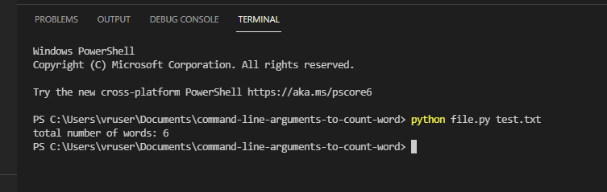

# command-line-arguments-to-count-word
## AIM:
To write a python program for getting the word count from the contents of a file using command line arguments.
## EQUIPEMENT'S REQUIRED: 
PC
Anaconda - Python 3.7
## ALGORITHM: 
### Step 1:
import sys
### Step 2: 
 open using command line arguments
### Step 3: 
open(sys.argv[1]) as fp
### Step 4:  
assign para to fp.read() of file
### Step 5: 
split the words
### Step 6: 
using len(word) print number of words
## PROGRAM:
```
''' 
Developed by Haridharshini.S
reference number:21500176
python program to count number of words using command line argument
'''

import sys
with open(sys.argv[1]) as fp:
  para=fp.read()
  word=para.split()
  print("total number of words:",len(word))
```
### OUTPUT:


## RESULT:
Thus the program is written to find the word count from the contents of a file using command line arguments.
